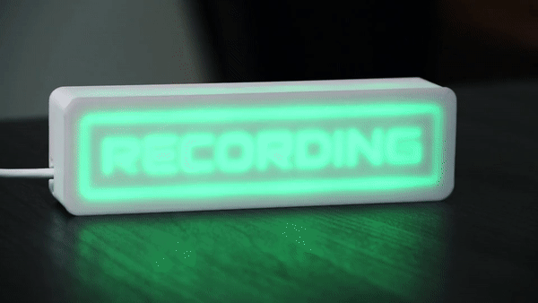

# Recording-Sign
A wifi recording sign that lights up when recording in a DAW (digital audio workstation).

## How it works
This uses rtpMIDI (with the help of Tobias Erichsen's [rtpMIDI](https://www.tobias-erichsen.de/software/rtpmidi.html) and Lathoub's [Arduino AppleMIDI library](https://github.com/lathoub/Arduino-AppleMIDI-Library)) to send MIDI messages from the DAW to an ESP32 over a local wifi network when the recording starts and stops. Based on the message received, the ESP32 lights up a NeoPixel strip in a certain color (with the help of Adafruits's [Arduino NeoPixel library](https://github.com/adafruit/Adafruit_NeoPixel)).

## Getting Started
- Visit [medium.com](https://jakesmd.medium.com/how-to-make-a-wifi-recording-sign-for-your-home-studio-f672b03b75f9) or [instructables.com](https://www.instructables.com/Wifi-Recording-Sign-Controlled-by-Your-DAW/) for a detailed tutorial on how to make your own for less than $20.
- Visit [thingiverse.com](https://www.thingiverse.com/thing:4800637) for more info on 3D printing an awesome case for it.

---
# Recording Sign 2.0 is coming a soon!!!
Love the Recording Sign? Well keep an eye out because the next version is coming soon as soon as I have time!
## Problems with the current version:
- WiFi credentials are hardcoded. This means the user has to edit the code and people with no programming experience will find that a bit intimidating.
- The user has to install some "random" software to upload the code but will never need the software again.
- It draws an unnecessary amount of power when not being used (99.9% of the time).
- For some reason one of mine wasn’t particularly reliable.

## Coming soon:
- Enter the WiFi credentials from your smartphone.
- Upload the code from a website via the (esptool-js)[https://github.com/espressif/esptool-js] package.
- 100% guaranteed it will work on MacOS now that I have the possibility to test it.
- Clever power saving stuff.
- OTA (automatically updates the code from the latest version on GitHub)
- A complete overhaul of the tutorials as they are not 100% correct.
- Multiple programs for different use cases (instead of NeoPixels):
  - Power an RGB strip
  - Toggle an LED
  - Toggle a relay (to turn a lamp on and off for example, or anything you want!)

## Other things I'm concidering
- Make it battery powered.
- A new case design.
- A custom PCB.
